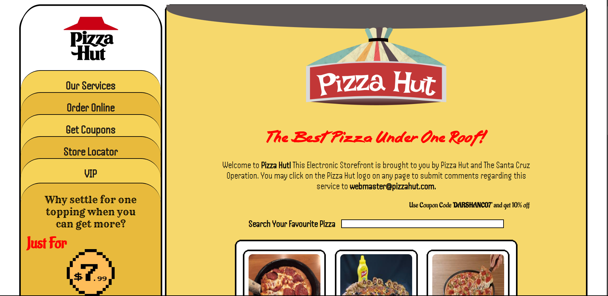
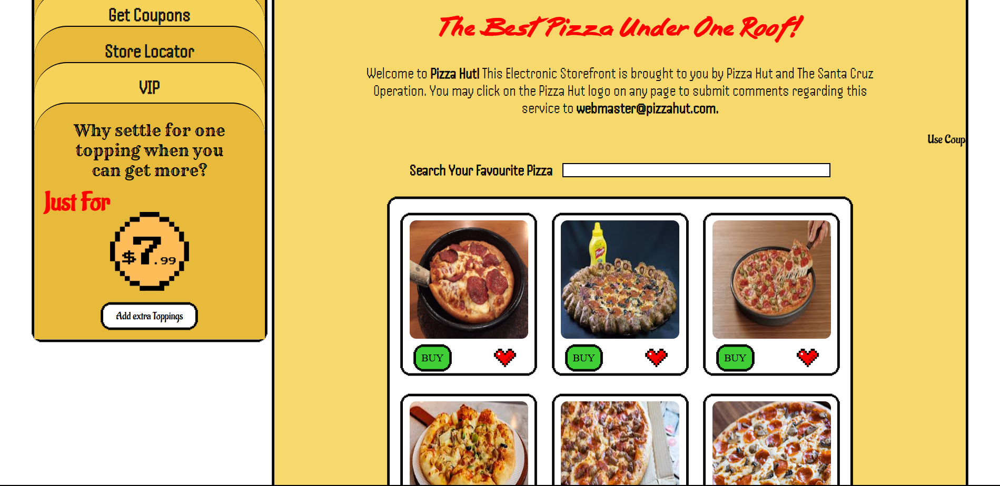
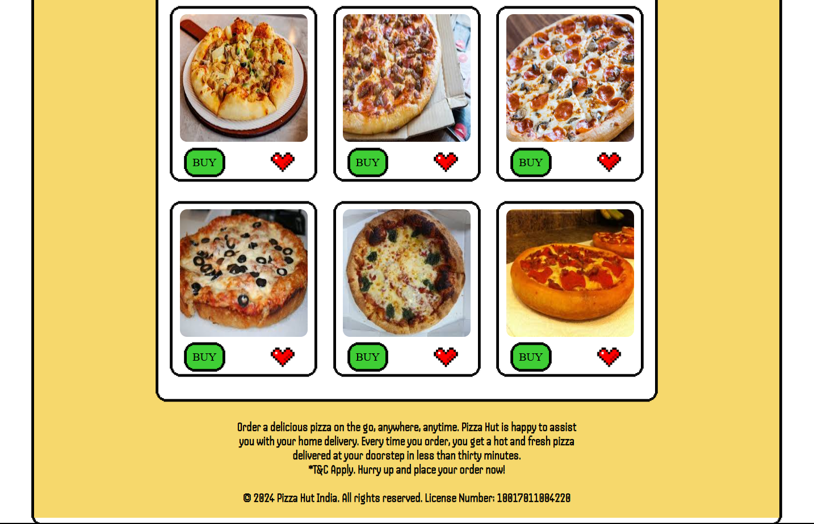
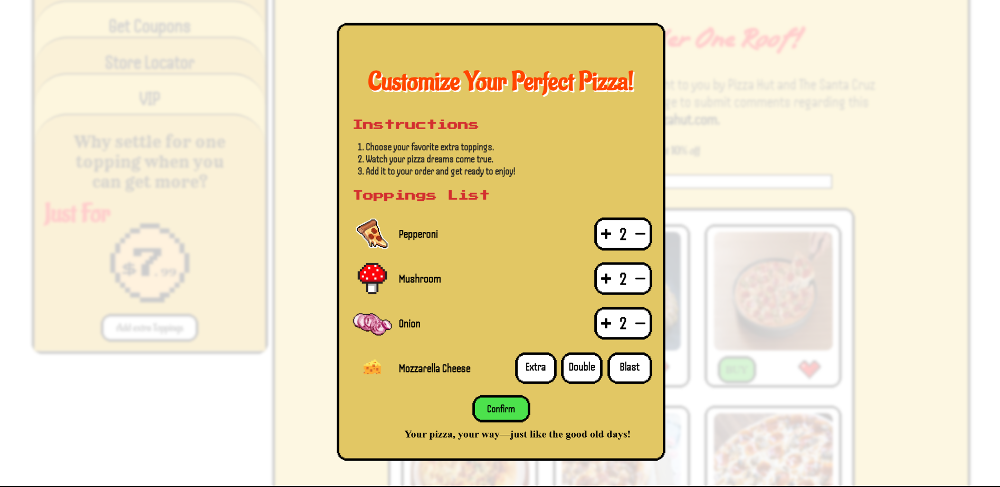
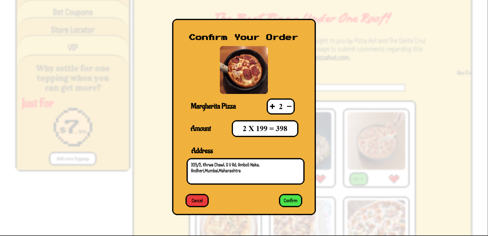
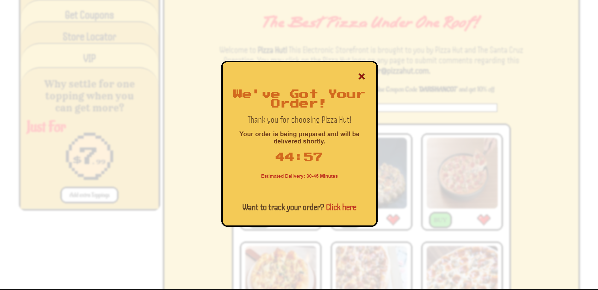

# Pizza-Hut
This is Pizza Hut would look like in 1990s with some retro feel. I designed it with keeping it mind things like limitations in that decade, layouts and fonts.
# Demo

# Key Features
1. Adding Extra Toppings : A dedicated container for user to add their favourite toppings.
2. Buy Pizza : Customer can buy pizza from menu.
3. Confirm Order : A popup card to accept order and show preparation timer.

# Feedback
If you have any feedback, please reach out to me at darshanchoudhary2007@gmail.com.
Also please provide your valuable feedback and support.
